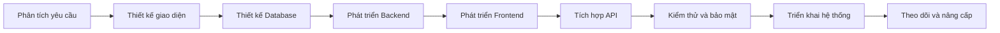
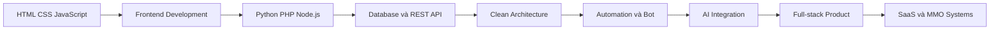

<!--
  GitHub Profile README
  Username: minhquan247
  Author: Minh Quân
-->

 

  

  

  

---

## 👨‍💻 Giới thiệu

Xin chào, mình là **Minh Quân**, hiện đang là **sinh viên năm 2 tại ICTU** và phát triển bản thân theo định hướng **Full-stack Developer**.

Mình có hơn **8 năm kinh nghiệm làm MMO**, vận hành dịch vụ số, support mạng xã hội, phát triển website, ứng dụng, API, bot và các công cụ tự động hóa.

Mình tập trung chuyên sâu vào:

- **Python** cho API, bot, automation, xử lý dữ liệu và tích hợp AI
- **PHP** cho website dịch vụ, hệ thống quản lý và backend
- **JavaScript** cho frontend, backend Node.js và ứng dụng tương tác
- **HTML/CSS** cho giao diện responsive và landing page
- **C# / ASP.NET Core** cho phần mềm và hệ thống quản lý
- **Facebook, TikTok và social media support**
- **Website, Web App, Desktop App và RESTful API**
- **Telegram Bot, chatbot và hệ thống thông báo tự động**
- **OpenAI API, Gemini API và AI-powered Applications**
- **Dashboard, báo cáo, quản lý khách hàng và đơn hàng**

Mục tiêu của mình là kết hợp kinh nghiệm MMO, kiến thức lập trình và tư duy sản phẩm để xây dựng các hệ thống có khả năng vận hành thực tế, bảo mật, dễ sử dụng và dễ mở rộng.

---

## 🧑‍🎓 Thông tin nhanh

<table>
  <tr>
    <td width="30%"><strong>👤 Họ và tên</strong></td>
    <td>Minh Quân</td>
  </tr>

  <tr>
    <td><strong>🎓 Học tập</strong></td>
    <td>Sinh viên năm 2 tại ICTU</td>
  </tr>

  <tr>
    <td><strong>💼 Kinh nghiệm</strong></td>
    <td>8+ năm làm MMO và vận hành dịch vụ số</td>
  </tr>

  <tr>
    <td><strong>💻 Định hướng</strong></td>
    <td>Full-stack Developer</td>
  </tr>

  <tr>
    <td><strong>⌨️ Ngôn ngữ chính</strong></td>
    <td>Python, PHP, JavaScript, HTML, CSS và C#</td>
  </tr>

  <tr>
    <td><strong>🌐 Chuyên môn</strong></td>
    <td>Website, App, API, Bot, Automation và AI Integration</td>
  </tr>

  <tr>
    <td><strong>📱 Dịch vụ</strong></td>
    <td>Facebook Support, TikTok, Social Media và hệ thống MMO</td>
  </tr>

  <tr>
    <td><strong>📍 Khu vực</strong></td>
    <td>Việt Nam</td>
  </tr>
</table>

---

## 💼 Kinh nghiệm MMO và dịch vụ số

Mình có hơn **8 năm kinh nghiệm làm MMO**, từng tìm hiểu, xây dựng và vận hành nhiều hệ thống phục vụ kinh doanh trực tuyến.

Thay vì chỉ xử lý công việc thủ công, mình ưu tiên xây dựng website, phần mềm, API và công cụ automation để tối ưu thời gian và giảm sai sót trong quá trình vận hành.

### Các lĩnh vực mình tập trung

- Xây dựng website cung cấp dịch vụ số
- Hệ thống quản lý đơn hàng MMO
- Hệ thống cộng tác viên và đại lý
- Quản lý số dư và lịch sử giao dịch
- Dashboard theo dõi doanh thu
- Tự động hóa quy trình xử lý đơn
- Bot nhận đơn và gửi thông báo
- Kết nối API nhà cung cấp
- Quản lý khách hàng và lịch sử sử dụng
- Hệ thống ticket hỗ trợ khách hàng
- Affiliate Marketing
- Thương mại điện tử
- Quản lý sản phẩm số
- Xây dựng landing page bán hàng
- Theo dõi hiệu suất chiến dịch
- Quản lý nội dung mạng xã hội
- Phân tích và xử lý dữ liệu
- Tích hợp thanh toán
- Bảo mật và phân quyền tài khoản

---

## 🛡️ Facebook Support và khôi phục tài khoản

Mình hỗ trợ người dùng xử lý các vấn đề Facebook theo hướng **chính chủ, minh bạch và tuân thủ quy trình của Meta**.

### Hỗ trợ tài khoản Facebook

- Hỗ trợ khôi phục tài khoản Facebook chính chủ
- Hướng dẫn kháng nghị tài khoản bị vô hiệu hóa
- Kiểm tra nguyên nhân tài khoản bị hạn chế
- Hỗ trợ tài khoản bị checkpoint
- Hỗ trợ xác minh danh tính chính chủ
- Hỗ trợ xử lý mất quyền truy cập email hoặc số điện thoại
- Hướng dẫn lấy lại tài khoản bị chiếm quyền
- Kiểm tra phiên đăng nhập bất thường
- Hướng dẫn thiết lập xác thực hai lớp
- Tăng cường bảo mật tài khoản
- Kiểm tra thiết bị và phiên đăng nhập
- Hướng dẫn đổi mật khẩu và bảo vệ thông tin
- Hỗ trợ xử lý tài khoản bị giả mạo
- Hướng dẫn báo cáo tài khoản giả danh
- Hỗ trợ gửi biểu mẫu kháng nghị phù hợp
- Kiểm tra trạng thái tài khoản trong Account Status

### Support Fanpage

- Hỗ trợ khôi phục quyền quản trị Fanpage
- Kiểm tra vai trò và quyền truy cập Trang
- Hỗ trợ xử lý Page bị hạn chế
- Hướng dẫn kháng nghị Page bị vô hiệu hóa
- Thiết lập quyền quản trị an toàn
- Quản lý thành viên và phân quyền
- Hỗ trợ kết nối Fanpage với Instagram
- Cấu hình Meta Business Suite
- Thiết lập chatbot Fanpage
- Quản lý tin nhắn và bình luận
- Hỗ trợ lên lịch nội dung
- Dashboard theo dõi hoạt động Fanpage
- Hướng dẫn bảo vệ Page khỏi bị chiếm quyền
- Kiểm tra tài khoản đang quản lý Trang

### Support Business Manager

- Hỗ trợ cấu hình Meta Business Manager
- Kiểm tra quyền quản trị doanh nghiệp
- Phân quyền tài khoản quảng cáo
- Quản lý Page, Pixel và tài sản doanh nghiệp
- Hỗ trợ kháng nghị hạn chế Business
- Kiểm tra trạng thái tài khoản quảng cáo
- Hướng dẫn xác minh doanh nghiệp
- Thiết lập bảo mật hai lớp
- Kiểm tra người dùng và đối tác
- Hỗ trợ xử lý mất quyền truy cập Business
- Cấu hình Meta Pixel
- Kết nối website và tên miền
- Kiểm tra tài sản bị chia sẻ sai quyền

### Nguyên tắc hỗ trợ

> Chỉ hỗ trợ tài khoản chính chủ hoặc người có quyền quản trị hợp pháp. Không hỗ trợ hack, phishing, bypass bảo mật, giả mạo giấy tờ, chiếm đoạt tài khoản hoặc truy cập trái phép vào tài sản của người khác.

---

## 🌐 Social Media Support

<table>
  <tr>
    <td width="25%" valign="top">
      <h3 align="center">📘 Facebook</h3>
      

        • Khôi phục tài khoản chính chủ 
        • Kháng nghị vô hiệu hóa 
        • Support checkpoint 
        • Support Fanpage 
        • Meta Business Suite 
        • Bảo mật tài khoản 
        • Chatbot và API
      

    </td>

    <td width="25%" valign="top">
      <h3 align="center">🎵 TikTok</h3>
      

        • Support tài khoản 
        • Hướng dẫn kháng nghị 
        • TikTok Business 
        • Quản lý nội dung 
        • Dashboard thống kê 
        • Landing page 
        • Tích hợp API
      

    </td>

    <td width="25%" valign="top">
      <h3 align="center">📷 Instagram</h3>
      

        • Bảo mật tài khoản 
        • Khôi phục chính chủ 
        • Kết nối Fanpage 
        • Quản lý nội dung 
        • Tin nhắn tự động 
        • Instagram Business 
        • Dashboard dữ liệu
      

    </td>

    <td width="25%" valign="top">
      <h3 align="center">✈️ Telegram</h3>
      

        • Telegram Bot 
        • Bot bán hàng 
        • Bot nhận đơn 
        • Bot thông báo 
        • Quản lý thành viên 
        • Tích hợp thanh toán 
        • Telegram API
      

    </td>
  </tr>

  <tr>
    <td width="25%" valign="top">
      <h3 align="center">▶️ YouTube</h3>
      

        • Quản lý kênh 
        • Dashboard thống kê 
        • Quản lý nội dung 
        • YouTube Data API 
        • Tự động lấy dữ liệu 
        • Theo dõi video 
        • Báo cáo hiệu suất
      

    </td>

    <td width="25%" valign="top">
      <h3 align="center">💬 Zalo</h3>
      

        • Zalo OA 
        • Quản lý khách hàng 
        • Gửi thông báo 
        • Chatbot hỗ trợ 
        • Website tích hợp Zalo 
        • Zalo API 
        • Quản lý tin nhắn
      

    </td>

    <td width="25%" valign="top">
      <h3 align="center">🛒 TikTok Shop</h3>
      

        • Dashboard đơn hàng 
        • Quản lý sản phẩm 
        • Theo dõi trạng thái 
        • Báo cáo doanh thu 
        • Quản lý khách hàng 
        • Đồng bộ dữ liệu 
        • Công cụ hỗ trợ vận hành
      

    </td>

    <td width="25%" valign="top">
      <h3 align="center">📊 Social Dashboard</h3>
      

        • Tổng hợp dữ liệu 
        • Theo dõi chỉ số 
        • Báo cáo tự động 
        • Quản lý tài khoản 
        • Phân quyền nhân viên 
        • Xuất Excel/PDF 
        • Cảnh báo bất thường
      

    </td>
  </tr>
</table>

---

## 🚀 Dịch vụ phát triển

<table>
  <tr>
    <td width="33%" valign="top">
      <h3 align="center">🌐 Website</h3>
      

        • Website giới thiệu 
        • Website bán hàng 
        • Website dịch vụ MMO 
        • Website quản lý đơn hàng 
        • Landing page 
        • Trang quản trị Admin 
        • Website responsive 
        • Website tích hợp API
      

    </td>

    <td width="33%" valign="top">
      <h3 align="center">📱 App & Software</h3>
      

        • Ứng dụng desktop 
        • Phần mềm quản lý 
        • Ứng dụng nội bộ 
        • Hệ thống quản lý khách hàng 
        • Quản lý nhân viên 
        • Quản lý kho và sản phẩm 
        • Dashboard báo cáo 
        • Đồng bộ dữ liệu
      

    </td>

    <td width="33%" valign="top">
      <h3 align="center">🔌 API Development</h3>
      

        • RESTful API 
        • API Authentication 
        • JWT và phân quyền 
        • API thanh toán 
        • API mạng xã hội 
        • API xử lý dữ liệu 
        • Webhook 
        • API Documentation
      

    </td>
  </tr>

  <tr>
    <td width="33%" valign="top">
      <h3 align="center">🤖 Bot</h3>
      

        • Telegram Bot 
        • Facebook Chatbot 
        • Discord Bot 
        • Bot bán hàng 
        • Bot chăm sóc khách hàng 
        • Bot nhận đơn 
        • Bot báo cáo 
        • Bot quản trị
      

    </td>

    <td width="33%" valign="top">
      <h3 align="center">⚙️ Automation</h3>
      

        • Python Automation 
        • Selenium Automation 
        • Xử lý dữ liệu tự động 
        • Gửi thông báo tự động 
        • Đồng bộ dữ liệu 
        • Tác vụ định kỳ 
        • Web scraping hợp lệ 
        • Workflow Automation
      

    </td>

    <td width="33%" valign="top">
      <h3 align="center">🧠 AI Integration</h3>
      

        • Chatbot AI 
        • OpenAI API 
        • Gemini API 
        • Trợ lý khách hàng 
        • Tóm tắt nội dung 
        • Phân tích dữ liệu 
        • Sinh nội dung 
        • AI-powered Application
      

    </td>
  </tr>
</table>

---

# 🧑‍💻 Chuyên sâu lập trình

## 🐍 Python Development

Python là một trong những ngôn ngữ mình tập trung chuyên sâu nhất, đặc biệt trong các hệ thống API, bot, automation và AI.

### Python Backend

- FastAPI
- Django
- Django REST Framework
- Flask
- RESTful API
- JWT Authentication
- OAuth
- API Key Authentication
- Middleware
- Background Tasks
- WebSocket
- AsyncIO
- Dependency Injection
- Clean Architecture
- Repository Pattern
- Service Layer
- Logging và Error Handling

### Python Automation

- Selenium
- Playwright
- Requests
- Beautiful Soup
- Schedule
- APScheduler
- Webhook
- Telegram Bot
- File Automation
- Excel Automation
- Email Automation
- Data Synchronization
- Task Queue
- Cron Job

### Python Data và AI

- NumPy
- Pandas
- Matplotlib
- Data Cleaning
- Data Processing
- Excel và CSV
- OpenAI API
- Gemini API
- Prompt Engineering
- Chatbot
- Text Processing
- AI Integration
- Vector Database
- Semantic Search

  
  
  
  
  

---

## 🐘 PHP Development

Mình sử dụng PHP để phát triển website dịch vụ, hệ thống quản lý, API và các trang quản trị.

### PHP Backend

- PHP Native
- PHP OOP
- Laravel
- MVC Architecture
- Routing
- Middleware
- Authentication
- Authorization
- Session và Cookie
- RESTful API
- Form Validation
- File Upload
- Payment Integration
- Queue và Job
- Cron Job
- Email Notification
- API Integration

### PHP Website Systems

- Website dịch vụ MMO
- Website bán hàng
- Website quản lý đơn hàng
- Hệ thống tài khoản người dùng
- Hệ thống số dư
- Lịch sử giao dịch
- Cổng thanh toán
- Hệ thống cộng tác viên
- Hệ thống đại lý
- Admin Dashboard
- Ticket Support
- Quản lý sản phẩm
- Quản lý khách hàng

  
  
  
  
  

---

## 🟨 JavaScript Development

JavaScript được sử dụng trong cả frontend và backend để xây dựng ứng dụng web hiện đại, dashboard và hệ thống realtime.

### JavaScript Frontend

- JavaScript ES6+
- DOM Manipulation
- Fetch API
- AJAX
- Local Storage
- Session Storage
- Form Validation
- Responsive Navigation
- Interactive Dashboard
- Data Table
- Chart và Visualization
- Realtime Interface
- React
- Next.js
- Component Architecture
- State Management

### JavaScript Backend

- Node.js
- Express.js
- RESTful API
- Middleware
- JWT Authentication
- WebSocket
- Socket.IO
- File Upload
- API Integration
- Webhook
- Background Job
- MongoDB Integration
- MySQL Integration
- Redis Integration

  
  
  
  
  

---

## 🟧 HTML và CSS

Mình tập trung xây dựng giao diện rõ ràng, responsive, thân thiện với người dùng và tương thích với nhiều thiết bị.

### HTML

- Semantic HTML
- HTML5
- Form
- Table
- SEO Structure
- Accessibility
- Metadata
- Open Graph
- Responsive Layout
- Component Structure

### CSS

- CSS3
- Flexbox
- CSS Grid
- Responsive Design
- Animation
- Transition
- Media Query
- CSS Variable
- Dark Mode
- Bootstrap
- Tailwind CSS
- Mobile First
- UI Component
- Landing Page Design

  
  
  
  

---

## 🔷 C# và ASP.NET Core

- C#
- Object-Oriented Programming
- ASP.NET Core MVC
- ASP.NET Core Web API
- Entity Framework Core
- LINQ
- Dependency Injection
- Identity
- JWT Authentication
- Role và Permission
- SQL Server
- Clean Architecture
- Repository Pattern
- Desktop Application
- Windows Forms
- Software Management System

  
  
  

---

## 🛠️ Toàn bộ công nghệ và công cụ

### 💻 Ngôn ngữ lập trình

  
  
  
  
  
  
  
  

### ⚙️ Backend

  
  
  
  
  
  
  

### 🎨 Frontend

  
  
  
  
  

### 🗄️ Cơ sở dữ liệu

  
  
  
  
  
  

### 🤖 Automation, Data và AI

  
  
  
  
  
  
  

### 🔧 Công cụ phát triển

  
  
  
  
  
  
  

### ☁️ Hosting và triển khai

  
  
  
  
  

---

## 🧩 Các loại dự án mình có thể xây dựng

- Website dịch vụ Facebook và TikTok
- Website dịch vụ MMO
- Website bán hàng
- Website thương mại điện tử
- Website quản lý đơn hàng
- Landing page giới thiệu dịch vụ
- Hệ thống quản lý khách hàng
- Hệ thống quản lý cộng tác viên
- Hệ thống quản lý đại lý
- Hệ thống số dư người dùng
- Hệ thống nạp tiền và thanh toán
- Lịch sử giao dịch
- Admin Dashboard
- Phân quyền người dùng
- Ticket Support
- Phần mềm quản lý sinh viên
- Phần mềm quản lý nhân viên
- Phần mềm quản lý kho
- Phần mềm quản lý sản phẩm
- Phần mềm quản lý doanh thu
- RESTful API
- API cho ứng dụng mobile
- API mạng xã hội
- Telegram Bot
- Facebook Chatbot
- Bot bán hàng
- Bot chăm sóc khách hàng
- Bot nhận đơn
- Bot gửi thông báo
- Công cụ automation Python
- Công cụ xử lý Excel
- Dashboard thống kê
- Chatbot tích hợp AI
- Hệ thống phân tích dữ liệu
- Ứng dụng desktop
- Ứng dụng quản lý nội bộ
- Hệ thống SaaS
- Webhook và hệ thống realtime

---

## 🎯 Trọng tâm hiện tại

<table>
  <tr>
    <td>🎓 <strong>Học tập</strong></td>
    <td>Củng cố kiến thức lập trình, cấu trúc dữ liệu, cơ sở dữ liệu và phát triển phần mềm.</td>
  </tr>

  <tr>
    <td>🐍 <strong>Python</strong></td>
    <td>API, bot, automation, xử lý dữ liệu và tích hợp AI.</td>
  </tr>

  <tr>
    <td>🐘 <strong>PHP</strong></td>
    <td>Website dịch vụ, hệ thống quản lý, Laravel và RESTful API.</td>
  </tr>

  <tr>
    <td>🟨 <strong>JavaScript</strong></td>
    <td>Frontend, Node.js, dashboard và ứng dụng realtime.</td>
  </tr>

  <tr>
    <td>🌐 <strong>HTML/CSS</strong></td>
    <td>Giao diện responsive, landing page và trải nghiệm người dùng.</td>
  </tr>

  <tr>
    <td>🏗️ <strong>Kiến trúc</strong></td>
    <td>Clean Code, Clean Architecture, Design Pattern và RESTful API.</td>
  </tr>

  <tr>
    <td>🤖 <strong>AI</strong></td>
    <td>LLM, chatbot, OpenAI API, Gemini API và AI-powered Applications.</td>
  </tr>

  <tr>
    <td>📱 <strong>Social Support</strong></td>
    <td>Khôi phục chính chủ, bảo mật, kháng nghị và quản lý nền tảng mạng xã hội.</td>
  </tr>

  <tr>
    <td>📈 <strong>MMO</strong></td>
    <td>Xây dựng hệ thống, website và công cụ hỗ trợ vận hành dịch vụ số.</td>
  </tr>
</table>

---

## 🗺️ Quy trình phát triển sản phẩm

---

## 🧭 Lộ trình phát triển

---

## 🏆 GitHub Trophy

---

## 📊 Tổng quan GitHub

 

 

---

## 🔥 Chuỗi đóng góp

---

## 📈 Biểu đồ hoạt động GitHub

---

## 📐 GitHub Metrics

---

## 🗓️ Lịch đóng góp cả năm

---

## 🐍 Contribution Snake

<picture>
  <source
    media="(prefers-color-scheme: dark)"
    srcset="https://raw.githubusercontent.com/minhquan247/minhquan247/output/github-contribution-grid-snake-dark.svg"
  />

  <source
    media="(prefers-color-scheme: light)"
    srcset="https://raw.githubusercontent.com/minhquan247/minhquan247/output/github-contribution-grid-snake.svg"
  />

  
</picture>

---

## 🤝 Hợp tác

Mình sẵn sàng trao đổi và hợp tác trong các dự án liên quan đến:

- Website và web application
- Website dịch vụ MMO
- Phần mềm quản lý
- Ứng dụng desktop
- Facebook Support chính chủ
- TikTok và Social Media Support
- Hệ thống quản trị mạng xã hội
- Python Automation
- PHP và Laravel
- JavaScript và Node.js
- RESTful API
- Telegram Bot
- Dashboard và xử lý dữ liệu
- Chatbot và tích hợp AI
- Công cụ hỗ trợ kinh doanh trực tuyến
- Hệ thống quản lý khách hàng
- Hệ thống cộng tác viên và đại lý

---

## 📫 Kết nối với mình

  

💬 Mình luôn sẵn sàng học hỏi, trao đổi kiến thức và kết nối với những người có cùng đam mê về lập trình, MMO và công nghệ.

  

  ✨ Cảm ơn bạn đã ghé thăm GitHub Profile của mình!

  

