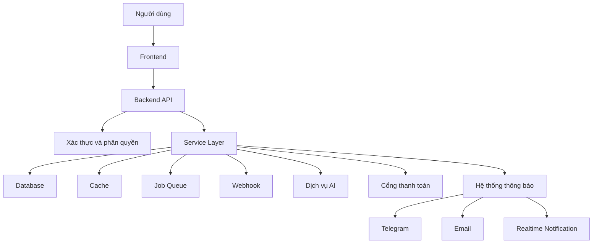
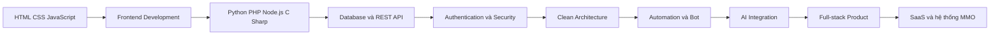

<!--
  GitHub Profile README
  Username: minhquan247
  Author: Minh Quân
-->

<h1>MINH QUÂN</h1>

  <strong>Sinh viên năm 2 tại ICTU</strong> 
  <strong>Full-stack Developer | MMO | Social Media Support | Automation | AI Integration</strong>

  

  

  

---

## Giới thiệu

Xin chào, mình là **Minh Quân**, hiện đang là **sinh viên năm 2 tại ICTU** và phát triển bản thân theo định hướng **Full-stack Developer**.

Mình có **8 năm kinh nghiệm làm MMO và dịch vụ số**, đồng thời tập trung phát triển website, ứng dụng, API, bot, công cụ tự động hóa, hệ thống quản lý và các sản phẩm tích hợp trí tuệ nhân tạo.

Mình đặc biệt quan tâm đến:

- **Python** cho backend API, bot, automation, xử lý dữ liệu và AI.
- **PHP** cho website dịch vụ, hệ thống quản lý, Laravel và RESTful API.
- **JavaScript** cho frontend, Node.js, dashboard và ứng dụng realtime.
- **HTML và CSS** cho giao diện responsive, landing page và admin dashboard.
- **C# và ASP.NET Core** cho API, phần mềm quản lý và ứng dụng desktop.
- **Facebook, TikTok và Social Media Support** theo hướng chính chủ, minh bạch.
- **Website, Web App, Desktop App, Bot và API Integration**.
- **OpenAI API, Gemini API, chatbot và AI-powered Applications**.
- **Dashboard, báo cáo, quản lý khách hàng, đơn hàng và doanh thu**.

Mục tiêu của mình là kết hợp kinh nghiệm vận hành thực tế với kỹ năng lập trình để xây dựng các hệ thống ổn định, bảo mật, dễ sử dụng và có khả năng mở rộng.

---

## Thông tin nhanh

<table>
  <tr>
    <td width="30%"><strong>Họ và tên</strong></td>
    <td>Minh Quân</td>
  </tr>
  <tr>
    <td><strong>Học tập</strong></td>
    <td>Sinh viên năm 2 tại ICTU</td>
  </tr>
  <tr>
    <td><strong>Kinh nghiệm</strong></td>
    <td>8 năm làm MMO và vận hành dịch vụ số</td>
  </tr>
  <tr>
    <td><strong>Định hướng</strong></td>
    <td>Full-stack Developer</td>
  </tr>
  <tr>
    <td><strong>Ngôn ngữ trọng tâm</strong></td>
    <td>Python, PHP, JavaScript, HTML, CSS, C# và SQL</td>
  </tr>
  <tr>
    <td><strong>Chuyên môn</strong></td>
    <td>Website, App, API, Bot, Automation, Database và AI Integration</td>
  </tr>
  <tr>
    <td><strong>Dịch vụ</strong></td>
    <td>Facebook Support, TikTok, Social Media và hệ thống MMO</td>
  </tr>
  <tr>
    <td><strong>Khu vực</strong></td>
    <td>Việt Nam</td>
  </tr>
</table>

---

## Kỹ năng và Công nghệ sử dụng

<strong>Ngôn ngữ lập trình, AI và nền tảng cốt lõi</strong>

  

<strong>Frontend và Backend Framework</strong>

  

<strong>Cơ sở dữ liệu, DevOps và công cụ phát triển</strong>

---

## Năng lực cốt lõi

<table>
  <tr>
    <td width="25%"><strong>Backend Development</strong></td>
    <td>FastAPI, Django, Flask, Laravel, Node.js, Express.js, ASP.NET Core và RESTful API.</td>
  </tr>
  <tr>
    <td><strong>Frontend Development</strong></td>
    <td>HTML5, CSS3, JavaScript, TypeScript, React, Next.js, Bootstrap và Tailwind CSS.</td>
  </tr>
  <tr>
    <td><strong>Database</strong></td>
    <td>SQL Server, MySQL, PostgreSQL, MongoDB, SQLite và Redis.</td>
  </tr>
  <tr>
    <td><strong>Automation</strong></td>
    <td>Python Automation, Selenium, Playwright, bot, webhook, scheduled task và data synchronization.</td>
  </tr>
  <tr>
    <td><strong>AI Integration</strong></td>
    <td>OpenAI API, Gemini API, chatbot, semantic search, embedding, RAG và workflow tích hợp AI.</td>
  </tr>
  <tr>
    <td><strong>Social Support</strong></td>
    <td>Facebook, Fanpage, Meta Business, TikTok, Instagram, Telegram, YouTube và Zalo.</td>
  </tr>
  <tr>
    <td><strong>DevOps</strong></td>
    <td>Git, GitHub Actions, Docker, Nginx, Linux, Cloudflare, Vercel và VPS.</td>
  </tr>
</table>

---

## Kinh nghiệm MMO và dịch vụ số

Mình có 8 năm kinh nghiệm tìm hiểu, xây dựng và vận hành các mô hình MMO cùng nhiều loại dịch vụ trực tuyến.

Các lĩnh vực mình tập trung:

- Website cung cấp dịch vụ số.
- Hệ thống quản lý đơn hàng MMO.
- Hệ thống cộng tác viên, đại lý và reseller.
- Quản lý số dư và lịch sử giao dịch.
- Dashboard theo dõi doanh thu và hoạt động.
- Tự động hóa quy trình xử lý đơn hàng.
- Bot nhận đơn, kiểm tra trạng thái và gửi thông báo.
- Kết nối API nhà cung cấp.
- Hệ thống ticket hỗ trợ khách hàng.
- Quản lý sản phẩm và dịch vụ số.
- Affiliate Marketing.
- Thương mại điện tử.
- Landing page phục vụ chiến dịch.
- Quản lý nội dung mạng xã hội.
- Phân tích, tổng hợp và xuất báo cáo dữ liệu.
- Tích hợp thanh toán và webhook.
- Phân quyền người dùng và nhật ký hoạt động.
- Hệ thống SaaS theo mô hình đăng ký.
- Đồng bộ dữ liệu giữa nhiều hệ thống.
- Công cụ hỗ trợ chăm sóc khách hàng.

---

## Facebook Support và khôi phục tài khoản

Mình hỗ trợ người dùng xử lý các vấn đề Facebook theo hướng **chính chủ, minh bạch và tuân thủ quy trình của Meta**.

### Hỗ trợ tài khoản Facebook

- Hỗ trợ mở khóa và khôi phục tài khoản Facebook chính chủ.
- Hướng dẫn kháng nghị tài khoản bị vô hiệu hóa.
- Kiểm tra nguyên nhân tài khoản bị hạn chế.
- Hỗ trợ tài khoản bị checkpoint.
- Hướng dẫn xác minh danh tính chính chủ.
- Hỗ trợ xử lý mất quyền truy cập email hoặc số điện thoại.
- Hướng dẫn bảo vệ tài khoản bị chiếm quyền.
- Kiểm tra phiên đăng nhập bất thường.
- Hướng dẫn thiết lập xác thực hai lớp.
- Hướng dẫn đổi mật khẩu và bảo vệ thông tin.
- Hỗ trợ xử lý tài khoản bị giả mạo.
- Hướng dẫn báo cáo tài khoản giả danh.
- Hướng dẫn gửi biểu mẫu kháng nghị phù hợp.
- Kiểm tra trạng thái tài khoản trong Account Status.
- Kiểm tra quyền truy cập của ứng dụng bên thứ ba.
- Hướng dẫn lưu và sử dụng mã khôi phục.

### Support Fanpage

- Hỗ trợ khôi phục quyền quản trị Fanpage hợp pháp.
- Kiểm tra vai trò và quyền truy cập Trang.
- Hướng dẫn xử lý Fanpage bị hạn chế.
- Hướng dẫn kháng nghị Page bị vô hiệu hóa.
- Thiết lập quyền quản trị an toàn.
- Quản lý thành viên và phân quyền.
- Kết nối Fanpage với Instagram.
- Cấu hình Meta Business Suite.
- Thiết lập chatbot Fanpage.
- Quản lý tin nhắn và bình luận.
- Hỗ trợ lên lịch nội dung.
- Xây dựng dashboard theo dõi Fanpage.
- Hướng dẫn bảo vệ Page khỏi bị chiếm quyền.
- Kiểm tra tài khoản và đối tác đang quản lý Trang.
- Tích hợp webhook và API được nền tảng cho phép.
- Xây dựng hệ thống phân công hội thoại cho nhân viên.

### Support Meta Business

- Cấu hình Meta Business Portfolio.
- Kiểm tra quyền quản trị doanh nghiệp.
- Phân quyền tài khoản quảng cáo.
- Quản lý Page, Pixel và tài sản doanh nghiệp.
- Hướng dẫn kháng nghị hạn chế Business.
- Kiểm tra trạng thái tài khoản quảng cáo.
- Hướng dẫn xác minh doanh nghiệp.
- Thiết lập bảo mật hai lớp.
- Kiểm tra người dùng và đối tác.
- Hỗ trợ xử lý mất quyền truy cập Business hợp pháp.
- Cấu hình Meta Pixel.
- Kết nối website và tên miền.
- Kiểm tra tài sản bị chia sẻ sai quyền.
- Tổ chức quyền truy cập theo vai trò.
- Theo dõi thay đổi và quy trình bàn giao tài sản.

### Nguyên tắc hỗ trợ

> Chỉ hỗ trợ tài khoản chính chủ hoặc người có quyền quản trị hợp pháp. Không hỗ trợ hack, phishing, giả mạo giấy tờ, chiếm đoạt tài khoản, vượt qua cơ chế bảo mật hoặc truy cập trái phép vào tài sản của người khác.

---

## Social Media Support

<table>
  <tr>
    <td width="25%" valign="top">
      <h3 align="center">Facebook</h3>
      

        Khôi phục tài khoản chính chủ 
        Kháng nghị vô hiệu hóa 
        Support checkpoint 
        Support Fanpage 
        Meta Business Suite 
        Bảo mật tài khoản 
        Chatbot và API
      

    </td>
    <td width="25%" valign="top">
      <h3 align="center">TikTok</h3>
      

        Support tài khoản 
        Hướng dẫn kháng nghị 
        TikTok Business 
        TikTok Shop 
        Quản lý nội dung 
        Dashboard thống kê 
        Tích hợp API
      

    </td>
    <td width="25%" valign="top">
      <h3 align="center">Instagram</h3>
      

        Bảo mật tài khoản 
        Khôi phục chính chủ 
        Kết nối Fanpage 
        Instagram Business 
        Quản lý nội dung 
        Quản lý tin nhắn 
        Dashboard dữ liệu
      

    </td>
    <td width="25%" valign="top">
      <h3 align="center">Telegram</h3>
      

        Telegram Bot 
        Bot bán hàng 
        Bot nhận đơn 
        Bot thông báo 
        Quản lý thành viên 
        Tích hợp thanh toán 
        Telegram API
      

    </td>
  </tr>
  <tr>
    <td width="25%" valign="top">
      <h3 align="center">YouTube</h3>
      

        Quản lý dữ liệu kênh 
        YouTube Data API 
        Theo dõi video 
        Dashboard thống kê 
        Báo cáo hiệu suất 
        Tự động lấy dữ liệu 
        Quản lý nội dung
      

    </td>
    <td width="25%" valign="top">
      <h3 align="center">Zalo</h3>
      

        Zalo Official Account 
        Quản lý khách hàng 
        Chatbot hỗ trợ 
        Gửi thông báo 
        Tích hợp Zalo API 
        Quản lý tin nhắn 
        Đồng bộ CRM
      

    </td>
    <td width="25%" valign="top">
      <h3 align="center">TikTok Shop</h3>
      

        Dashboard đơn hàng 
        Quản lý sản phẩm 
        Theo dõi trạng thái 
        Báo cáo doanh thu 
        Quản lý khách hàng 
        Đồng bộ dữ liệu 
        Công cụ vận hành
      

    </td>
    <td width="25%" valign="top">
      <h3 align="center">Social Dashboard</h3>
      

        Tổng hợp dữ liệu 
        Theo dõi chỉ số 
        Báo cáo tự động 
        Quản lý tài khoản 
        Phân quyền nhân viên 
        Xuất Excel và PDF 
        Cảnh báo bất thường
      

    </td>
  </tr>
</table>

---

## Dịch vụ phát triển

<table>
  <tr>
    <td width="33%" valign="top">
      <h3 align="center">Website</h3>
      

        Website giới thiệu 
        Website bán hàng 
        Website dịch vụ MMO 
        Website quản lý đơn hàng 
        Landing page 
        Trang quản trị Admin 
        Website responsive 
        Website tích hợp API
      

    </td>
    <td width="33%" valign="top">
      <h3 align="center">App và Software</h3>
      

        Ứng dụng desktop 
        Phần mềm quản lý 
        Ứng dụng nội bộ 
        Quản lý khách hàng 
        Quản lý nhân viên 
        Quản lý kho và sản phẩm 
        Dashboard báo cáo 
        Đồng bộ dữ liệu
      

    </td>
    <td width="33%" valign="top">
      <h3 align="center">API Development</h3>
      

        RESTful API 
        API Authentication 
        JWT và phân quyền 
        API thanh toán 
        API mạng xã hội 
        API xử lý dữ liệu 
        Webhook 
        OpenAPI và Swagger
      

    </td>
  </tr>
  <tr>
    <td width="33%" valign="top">
      <h3 align="center">Bot</h3>
      

        Telegram Bot 
        Facebook Chatbot 
        Discord Bot 
        Bot bán hàng 
        Bot chăm sóc khách hàng 
        Bot nhận đơn 
        Bot báo cáo 
        Bot quản trị
      

    </td>
    <td width="33%" valign="top">
      <h3 align="center">Automation</h3>
      

        Python Automation 
        Selenium và Playwright 
        Xử lý dữ liệu tự động 
        Gửi thông báo tự động 
        Đồng bộ dữ liệu 
        Tác vụ định kỳ 
        Web scraping hợp lệ 
        Workflow Automation
      

    </td>
    <td width="33%" valign="top">
      <h3 align="center">AI Integration</h3>
      

        Chatbot AI 
        OpenAI API 
        Gemini API 
        Trợ lý khách hàng 
        Tóm tắt nội dung 
        Phân tích dữ liệu 
        Semantic Search 
        AI-powered Application
      

    </td>
  </tr>
</table>

---

# Chuyên sâu lập trình

## Python Development

Python là một trong những ngôn ngữ mình tập trung chuyên sâu nhất, đặc biệt trong các hệ thống API, bot, automation, xử lý dữ liệu và AI.

### Python Backend

- FastAPI.
- Django.
- Django REST Framework.
- Flask.
- Pydantic.
- SQLAlchemy.
- Alembic.
- RESTful API.
- JWT Authentication.
- OAuth.
- API Key Authentication.
- Middleware.
- Background Tasks.
- WebSocket.
- AsyncIO.
- Dependency Injection.
- Clean Architecture.
- Repository Pattern.
- Service Layer.
- Logging và Error Handling.
- Unit Testing và API Testing.

### Python Automation

- Selenium.
- Playwright.
- Requests và HTTPX.
- Beautiful Soup và LXML.
- Schedule và APScheduler.
- Telegram Bot.
- Discord Bot.
- File Automation.
- Excel Automation.
- Email Automation.
- Browser Automation.
- Data Synchronization.
- Task Queue.
- Cron Job.
- Webhook.
- Tự động tạo báo cáo.
- Tự động kiểm tra endpoint.
- Tự động sao lưu dữ liệu.
- Tự động gửi cảnh báo hệ thống.

### Python Data và AI

- NumPy.
- Pandas.
- Matplotlib.
- Data Cleaning.
- Data Processing.
- Excel và CSV.
- OpenAI API.
- Gemini API.
- Prompt Engineering.
- Chatbot.
- Text Processing.
- Embedding.
- Vector Database.
- Semantic Search.
- Retrieval-Augmented Generation.
- AI Agent cơ bản.
- Tích hợp AI vào website, app và bot.

---

## PHP Development

Mình sử dụng PHP để phát triển website dịch vụ, hệ thống quản lý, RESTful API và trang quản trị.

### PHP Backend

- PHP Native.
- PHP OOP.
- Laravel.
- MVC Architecture.
- Routing.
- Middleware.
- Authentication.
- Authorization.
- Session và Cookie.
- RESTful API.
- Form Validation.
- File Upload.
- Payment Integration.
- Queue và Job.
- Event và Listener.
- Cron Job.
- Email Notification.
- API Integration.
- Logging.
- Cache.
- Testing cơ bản.

### Hệ thống PHP

- Website dịch vụ MMO.
- Website bán hàng.
- Website quản lý đơn hàng.
- Hệ thống tài khoản người dùng.
- Hệ thống số dư.
- Lịch sử giao dịch.
- Cổng thanh toán.
- Hệ thống cộng tác viên.
- Hệ thống đại lý.
- Admin Dashboard.
- Ticket Support.
- Quản lý sản phẩm.
- Quản lý khách hàng.
- Quản lý mã giảm giá.
- Quản lý thông báo.
- Phân quyền người dùng.
- Tích hợp API nhà cung cấp.
- Đồng bộ trạng thái đơn hàng.
- Báo cáo doanh thu.

---

## JavaScript Development

JavaScript được sử dụng trong cả frontend và backend để xây dựng ứng dụng web hiện đại, dashboard và hệ thống realtime.

### JavaScript Frontend

- JavaScript ES6+.
- TypeScript.
- DOM Manipulation.
- Fetch API.
- AJAX.
- Local Storage và Session Storage.
- Form Validation.
- Responsive Navigation.
- Interactive Dashboard.
- Data Table.
- Chart và Visualization.
- Realtime Interface.
- React.
- Next.js.
- Component Architecture.
- State Management.
- Single Page Application.
- Progressive Web App cơ bản.

### JavaScript Backend

- Node.js.
- Express.js.
- RESTful API.
- Middleware.
- JWT Authentication.
- WebSocket.
- Socket.IO.
- File Upload.
- API Integration.
- Webhook.
- Background Job.
- MongoDB Integration.
- MySQL Integration.
- PostgreSQL Integration.
- Redis Integration.
- Queue.
- Realtime Notification.
- Server-side Rendering.

---

## HTML và CSS

Mình tập trung xây dựng giao diện rõ ràng, responsive, thân thiện với người dùng và tương thích với nhiều thiết bị.

### HTML

- Semantic HTML.
- HTML5.
- Form.
- Table.
- SEO Structure.
- Accessibility.
- Metadata.
- Open Graph.
- Responsive Layout.
- Component Structure.
- Landing Page Structure.
- Email Template.

### CSS

- CSS3.
- Flexbox.
- CSS Grid.
- Responsive Design.
- Animation.
- Transition.
- Media Query.
- CSS Variable.
- Dark Mode.
- Bootstrap.
- Tailwind CSS.
- Mobile First.
- UI Component.
- Dashboard Layout.
- Landing Page Design.
- Tối ưu hiển thị đa thiết bị.

---

## C# và ASP.NET Core

- C#.
- Object-Oriented Programming.
- ASP.NET Core MVC.
- ASP.NET Core Web API.
- Entity Framework Core.
- LINQ.
- Dependency Injection.
- ASP.NET Identity.
- JWT Authentication.
- Role và Permission.
- SQL Server.
- Clean Architecture.
- Repository Pattern.
- Service Layer.
- Windows Forms.
- Desktop Application.
- Software Management System.
- Logging và Validation.
- Unit Testing cơ bản.

---

## Cơ sở dữ liệu

- SQL Server.
- MySQL.
- PostgreSQL.
- MongoDB.
- SQLite.
- Redis.
- Thiết kế bảng và quan hệ dữ liệu.
- Chuẩn hóa dữ liệu.
- Index.
- Query Optimization.
- Transaction.
- Stored Procedure.
- View.
- Migration.
- Backup và Restore.
- Phân quyền truy cập dữ liệu.
- Cache dữ liệu.
- Audit Log.
- Soft Delete.
- Data Seeding.
- Import và Export dữ liệu.
- Đối soát dữ liệu.
- Thiết kế dữ liệu cho hệ thống SaaS.

---

## Bảo mật ứng dụng

- Authentication và Authorization.
- Role-based Access Control.
- Permission-based Access Control.
- JWT và Refresh Token.
- OAuth.
- Xác thực hai lớp.
- Hash mật khẩu.
- Mã hóa dữ liệu nhạy cảm.
- Chống SQL Injection.
- Chống Cross-Site Scripting.
- Chống Cross-Site Request Forgery.
- Rate Limiting.
- Kiểm tra dữ liệu đầu vào.
- Quản lý session.
- Audit Log.
- Security Header.
- CORS.
- Quản lý secret và environment variable.
- Giới hạn file upload.
- Nhật ký đăng nhập.
- Cảnh báo đăng nhập bất thường.
- Phân quyền API.
- Bảo vệ endpoint quản trị.
- Backup và kế hoạch khôi phục dữ liệu.

---

## DevOps và triển khai

- Git.
- GitHub.
- GitHub Actions.
- Docker.
- Docker Compose.
- Linux.
- Ubuntu Server.
- VPS.
- Nginx.
- Apache.
- Cloudflare.
- Vercel.
- Render.
- GitHub Pages.
- Domain và DNS.
- SSL/TLS.
- Reverse Proxy.
- Environment Configuration.
- Process Management.
- Log Management.
- Backup.
- Monitoring cơ bản.
- CI/CD cơ bản.
- Deployment frontend.
- Deployment backend.
- Deployment database.
- Cấu hình webhook.

---

## Các hệ thống mình có thể xây dựng

- Website dịch vụ Facebook và TikTok.
- Website dịch vụ mạng xã hội.
- Website dịch vụ MMO.
- Website bán hàng và thương mại điện tử.
- Website quản lý đơn hàng.
- Landing page.
- Trang quản trị Admin.
- Hệ thống tài khoản người dùng.
- Hệ thống đăng nhập và đăng ký.
- Hệ thống phân quyền.
- Hệ thống số dư và nạp tiền.
- Hệ thống thanh toán.
- Hệ thống lịch sử giao dịch.
- Hệ thống cộng tác viên, đại lý và reseller.
- Hệ thống voucher và mã giảm giá.
- Hệ thống ticket.
- Hệ thống CRM.
- Hệ thống CMS.
- Hệ thống quản lý kho.
- Hệ thống quản lý sản phẩm.
- Hệ thống quản lý khách hàng.
- Hệ thống quản lý nhân viên.
- Hệ thống quản lý sinh viên.
- Hệ thống quản lý doanh thu.
- Hệ thống báo cáo.
- Hệ thống audit log.
- Hệ thống thông báo.
- Hệ thống webhook.
- Hệ thống realtime.
- RESTful API.
- Telegram Bot.
- Chatbot AI.
- Công cụ Python Automation.
- Công cụ xử lý Excel.
- Công cụ đồng bộ dữ liệu.
- Dashboard thống kê.
- Ứng dụng desktop.
- Ứng dụng quản lý nội bộ.
- Hệ thống SaaS.
- Hệ thống multi-tenant.
- Hệ thống subscription.
- Hệ thống quản lý API key.
- Hệ thống theo dõi trạng thái dịch vụ.
- Hệ thống cảnh báo lỗi.
- Hệ thống sao lưu dữ liệu.
- Hệ thống tích hợp AI.

---

## Trọng tâm hiện tại

<table>
  <tr>
    <td width="25%"><strong>Học tập</strong></td>
    <td>Củng cố kiến thức lập trình, cấu trúc dữ liệu, giải thuật, cơ sở dữ liệu và kỹ thuật phần mềm.</td>
  </tr>
  <tr>
    <td><strong>Python</strong></td>
    <td>Backend API, bot, automation, xử lý dữ liệu và AI Integration.</td>
  </tr>
  <tr>
    <td><strong>PHP</strong></td>
    <td>Website dịch vụ, Laravel, hệ thống quản lý và RESTful API.</td>
  </tr>
  <tr>
    <td><strong>JavaScript</strong></td>
    <td>Frontend, Node.js, dashboard, web app và ứng dụng realtime.</td>
  </tr>
  <tr>
    <td><strong>HTML và CSS</strong></td>
    <td>Giao diện responsive, landing page, admin dashboard và trải nghiệm người dùng.</td>
  </tr>
  <tr>
    <td><strong>C#</strong></td>
    <td>ASP.NET Core, Web API, Entity Framework Core và phần mềm quản lý.</td>
  </tr>
  <tr>
    <td><strong>Kiến trúc</strong></td>
    <td>Clean Code, Clean Architecture, Repository Pattern, Service Layer và Design Pattern.</td>
  </tr>
  <tr>
    <td><strong>AI</strong></td>
    <td>OpenAI API, Gemini API, chatbot, semantic search và RAG.</td>
  </tr>
  <tr>
    <td><strong>Social Support</strong></td>
    <td>Khôi phục chính chủ, bảo mật, kháng nghị và quản lý tài sản mạng xã hội hợp pháp.</td>
  </tr>
  <tr>
    <td><strong>MMO</strong></td>
    <td>Xây dựng hệ thống, website và công cụ hỗ trợ vận hành dịch vụ số.</td>
  </tr>
</table>

---

## Quy trình phát triển sản phẩm

```mermaid
flowchart LR
    A[Phân tích yêu cầu] --> B[Thiết kế chức năng]
    B --> C[Thiết kế giao diện]
    C --> D[Thiết kế cơ sở dữ liệu]
    D --> E[Phát triển backend]
    E --> F[Phát triển frontend]
    F --> G[Tích hợp API]
    G --> H[Kiểm thử]
    H --> I[Bảo mật]
    I --> J[Triển khai]
    J --> K[Theo dõi và nâng cấp]
```

---

## Kiến trúc hệ thống tham khảo

---

## Lộ trình phát triển

---

## Thống kê GitHub

 

 

---

## Chuỗi đóng góp

---

## Biểu đồ hoạt động GitHub

---

## Nguyên tắc làm việc

- Tìm hiểu kỹ yêu cầu trước khi phát triển.
- Ưu tiên giải pháp rõ ràng, dễ bảo trì và dễ mở rộng.
- Bảo vệ thông tin và dữ liệu khách hàng.
- Hạn chế quyền truy cập theo đúng vai trò.
- Kiểm tra lỗi trước khi triển khai.
- Theo dõi hệ thống sau khi đưa vào sử dụng.
- Sao lưu dữ liệu quan trọng.
- Ghi lại lịch sử thao tác cần thiết.
- Không thu thập dữ liệu trái phép.
- Không xây dựng công cụ phishing hoặc chiếm đoạt tài khoản.
- Không hỗ trợ vượt qua cơ chế bảo mật.
- Tối ưu sản phẩm dựa trên dữ liệu vận hành thực tế.

---

## Hợp tác

Mình sẵn sàng trao đổi và hợp tác trong các dự án liên quan đến:

- Website và Web Application.
- Website dịch vụ MMO.
- Website bán hàng.
- Phần mềm quản lý.
- Ứng dụng desktop.
- Facebook Support chính chủ.
- TikTok và Social Media Support.
- Python Automation.
- PHP và Laravel.
- JavaScript, Node.js, React và Next.js.
- ASP.NET Core.
- RESTful API.
- Telegram Bot.
- Dashboard và xử lý dữ liệu.
- Chatbot và tích hợp AI.
- CRM và hệ thống ticket.
- Hệ thống SaaS.
- Công cụ hỗ trợ vận hành dịch vụ số.
- Hệ thống quản lý khách hàng, cộng tác viên và đại lý.

---

## Liên hệ

  

  Mình luôn sẵn sàng học hỏi, trao đổi kiến thức và kết nối với những người có cùng định hướng về lập trình, MMO, tự động hóa và công nghệ.

<strong>Cảm ơn bạn đã ghé thăm GitHub Profile của mình.</strong>

