<div align="center">



<br/>


<br/><br/>


</div>

---

## 👨‍💻 Giới thiệu

Xin chào, mình là **Minh Quân**, hiện đang là **sinh viên năm 2 tại ICTU** và đang từng bước phát triển bản thân theo định hướng trở thành một **Full-stack Developer**.

Mình yêu thích lập trình và công nghệ, đặc biệt quan tâm đến việc xây dựng **website**, **phần mềm quản lý**, **RESTful API**, **công cụ tự động hóa** và các ứng dụng tích hợp **trí tuệ nhân tạo**.

Trong quá trình học tập và thực hiện dự án cá nhân, mình luôn hướng đến việc viết mã nguồn rõ ràng, xây dựng giao diện hiện đại và thiết kế hệ thống có khả năng bảo trì, mở rộng trong tương lai.

* 🎓 Sinh viên năm 2 tại **ICTU**
* 🔭 Đang phát triển các dự án với **Python**, **ASP.NET Core** và **MERN Stack**
* 🌱 Đang học sâu hơn về **FastAPI**, **Clean Architecture** và **RESTful API**
* 🤖 Quan tâm đến **Automation**, **LLM**, **OpenAI API** và **Gemini API**
* 💡 Yêu thích việc biến ý tưởng thành các sản phẩm và công cụ thực tế
* 🎯 Mục tiêu trở thành một **Full-stack Developer** có khả năng xây dựng sản phẩm hoàn chỉnh
* ⚡ Sở thích: Lập trình, công nghệ, phần cứng và nghiên cứu các công cụ mới

---

## 🚀 Định hướng phát triển

```text
Frontend Development
        ↓
Backend Development
        ↓
Database & System Design
        ↓
Automation & AI Integration
        ↓
Full-stack Applications
```

Mục tiêu của mình không chỉ là học cách sử dụng các công nghệ, mà còn hiểu rõ cách chúng hoạt động và kết hợp chúng để xây dựng những sản phẩm có giá trị thực tế.

---

## 🛠️ Công nghệ và công cụ

### 💻 Ngôn ngữ lập trình

<p align="left">
  
  
  
  
  
</p>

### ⚙️ Backend Development

<p align="left">
  
  
  
  
  
  
</p>

### 🎨 Frontend Development

<p align="left">
  
  
  
</p>

### 🗄️ Cơ sở dữ liệu

<p align="left">
  
  
  
  
</p>

### 🐍 Python, AI và Automation

<p align="left">
  
  
  
  
  
</p>

### 🔧 Công cụ phát triển

<p align="left">
  
  
  
  
  
</p>

---

## 🎯 Trọng tâm hiện tại

<table>
  <tr>
    <td>🎓 <strong>Học tập</strong></td>
    <td>Củng cố kiến thức lập trình, cơ sở dữ liệu, cấu trúc dữ liệu và phát triển phần mềm</td>
  </tr>
  <tr>
    <td>🐍 <strong>Python</strong></td>
    <td>Xây dựng API, công cụ tự động hóa, xử lý dữ liệu và tích hợp AI</td>
  </tr>
  <tr>
    <td>🌐 <strong>Web Development</strong></td>
    <td>Phát triển ứng dụng với ASP.NET Core, React, Node.js, FastAPI và Django</td>
  </tr>
  <tr>
    <td>🏗️ <strong>Kiến trúc phần mềm</strong></td>
    <td>Clean Code, Clean Architecture, RESTful API và thiết kế hệ thống dễ mở rộng</td>
  </tr>
  <tr>
    <td>🤖 <strong>AI Integration</strong></td>
    <td>LLM, OpenAI API, Gemini API và các ứng dụng sử dụng trí tuệ nhân tạo</td>
  </tr>
</table>

---

## 📚 Những điều đang học

* Cấu trúc dữ liệu và giải thuật
* Lập trình hướng đối tượng
* Phát triển RESTful API
* Xác thực và phân quyền người dùng
* Clean Code và Clean Architecture
* Thiết kế và quản lý cơ sở dữ liệu
* Triển khai ứng dụng web
* Tích hợp AI vào website và phần mềm
* Git, GitHub và quy trình làm việc nhóm

---

## 💡 Một số loại dự án mình quan tâm

* Website bán hàng và quản lý đơn hàng
* Hệ thống quản lý sinh viên, nhân viên và khách hàng
* RESTful API cho ứng dụng web và mobile
* Telegram Bot và Discord Bot
* Công cụ tự động hóa bằng Python
* Web scraping và xử lý dữ liệu
* Ứng dụng chatbot tích hợp AI
* Hệ thống quản lý tài khoản và phân quyền
* Dashboard thống kê và báo cáo dữ liệu

---

## 📊 Thống kê GitHub

<div align="center">


</div>

<br/>

<div align="center">


</div>

> Thống kê ngôn ngữ sẽ chính xác hơn khi các repository chứa mã nguồn được đặt ở chế độ công khai.

---

## 📈 Biểu đồ hoạt động

<div align="center">


</div>

---

## 🐍 Contribution Snake

<div align="center">


</div>

---

## 📫 Kết nối với mình

<div align="center">

<a href="https://github.com/minhquan247">
  
</a>

<a href="https://t.me/minhquan2006">
  
</a>

<br/><br/>

💬 Mình luôn sẵn sàng học hỏi, trao đổi kiến thức và kết nối với những người có cùng đam mê công nghệ.

<br/>

<sub>✨ Cảm ơn bạn đã ghé thăm GitHub Profile của mình!</sub>

<br/><br/>


</div>
