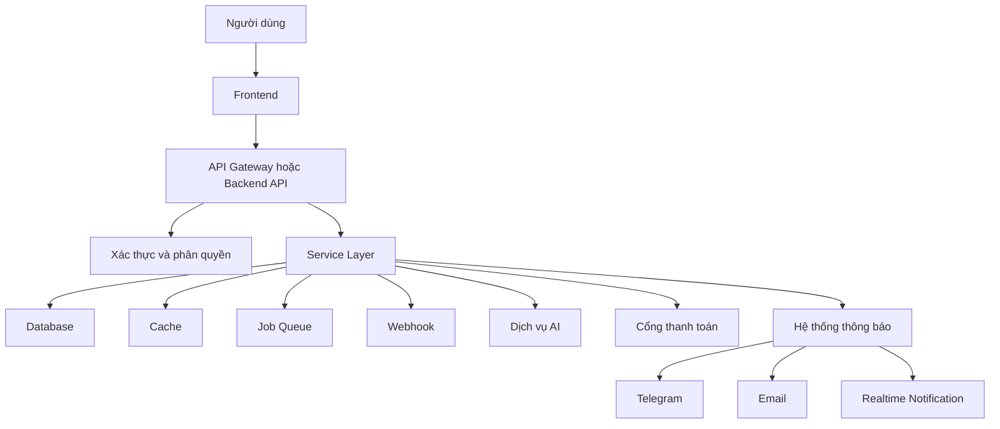
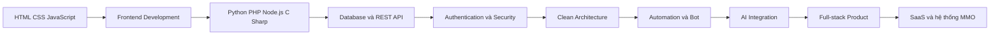

<h1>MINH QUÂN</h1>

<strong>Sinh viên năm 2 tại ICTU</strong>

<strong>Full-stack Developer | MMO | Social Media Support | Automation | AI Integration</strong>

Python | PHP | JavaScript | HTML | CSS | C# | SQL | API | Website | App | Bot

---

## Giới thiệu

Xin chào, mình là **Minh Quân**, hiện là **sinh viên năm 2 tại Trường Đại học Công nghệ Thông tin và Truyền thông - Đại học Thái Nguyên (ICTU)**.

Mình phát triển theo định hướng **Full-stack Developer**, tập trung vào xây dựng website, ứng dụng, phần mềm quản lý, RESTful API, bot, công cụ tự động hóa và các sản phẩm tích hợp trí tuệ nhân tạo.

Bên cạnh việc học tập và phát triển phần mềm, mình có **8 năm kinh nghiệm trong lĩnh vực MMO và dịch vụ số**. Kinh nghiệm này giúp mình hiểu rõ hơn về quy trình vận hành dịch vụ trực tuyến, quản lý khách hàng, xử lý đơn hàng, chăm sóc người dùng, support mạng xã hội, quản trị hệ thống và tự động hóa công việc.

Mục tiêu của mình là kết hợp kinh nghiệm vận hành thực tế với kỹ năng lập trình để tạo ra các sản phẩm có tính ứng dụng cao, dễ sử dụng, bảo mật, ổn định và có khả năng mở rộng.

---

## Thông tin tổng quan

<table>
  <tr>
    <td width="30%"><strong>Họ và tên</strong></td>
    <td>Minh Quân</td>
  </tr>
  <tr>
    <td><strong>Học tập</strong></td>
    <td>Sinh viên năm 2 tại ICTU</td>
  </tr>
  <tr>
    <td><strong>Định hướng</strong></td>
    <td>Full-stack Developer</td>
  </tr>
  <tr>
    <td><strong>Kinh nghiệm</strong></td>
    <td>8 năm làm MMO, dịch vụ số và support mạng xã hội</td>
  </tr>
  <tr>
    <td><strong>Ngôn ngữ trọng tâm</strong></td>
    <td>Python, PHP, JavaScript, HTML, CSS, C# và SQL</td>
  </tr>
  <tr>
    <td><strong>Lĩnh vực phát triển</strong></td>
    <td>Website, Web App, Desktop App, API, Bot, Automation và AI</td>
  </tr>
  <tr>
    <td><strong>Lĩnh vực dịch vụ</strong></td>
    <td>Facebook, TikTok, Instagram, Telegram, YouTube, Zalo và hệ thống MMO</td>
  </tr>
  <tr>
    <td><strong>Khu vực</strong></td>
    <td>Việt Nam</td>
  </tr>
</table>

---

## Định hướng chuyên môn

Mình tập trung phát triển theo các nhóm kỹ năng sau:

1. Phát triển website và ứng dụng web hoàn chỉnh.
2. Xây dựng backend, API và hệ thống xử lý dữ liệu.
3. Thiết kế trang quản trị, dashboard và phần mềm quản lý.
4. Phát triển bot và công cụ tự động hóa.
5. Tích hợp API mạng xã hội và các dịch vụ bên thứ ba.
6. Tích hợp mô hình AI vào website, ứng dụng và quy trình vận hành.
7. Xây dựng hệ thống phục vụ MMO, thương mại điện tử và dịch vụ số.
8. Thiết kế hệ thống xác thực, phân quyền, nhật ký hoạt động và bảo mật.
9. Triển khai ứng dụng lên VPS, hosting và nền tảng đám mây.
10. Theo dõi, bảo trì và nâng cấp sản phẩm sau khi triển khai.

---

## Kinh nghiệm MMO và dịch vụ số

Mình có 8 năm kinh nghiệm tìm hiểu, vận hành và phát triển các mô hình MMO cùng nhiều loại dịch vụ trực tuyến.

Các công việc và hệ thống mình quan tâm gồm:

- Xây dựng website cung cấp dịch vụ số.
- Xây dựng hệ thống quản lý đơn hàng.
- Quản lý tài khoản khách hàng.
- Quản lý số dư, giao dịch và lịch sử thanh toán.
- Hệ thống cộng tác viên, đại lý và reseller.
- Hệ thống ticket hỗ trợ khách hàng.
- Hệ thống thông báo qua Telegram, email và webhook.
- Dashboard theo dõi doanh thu và hoạt động.
- Tự động hóa quy trình xử lý đơn hàng.
- Kết nối API nhà cung cấp.
- Đồng bộ dữ liệu giữa nhiều hệ thống.
- Quản lý sản phẩm và dịch vụ.
- Quản lý nội dung số.
- Affiliate Marketing.
- Thương mại điện tử.
- Landing page phục vụ chiến dịch.
- Website giới thiệu dịch vụ.
- Công cụ chăm sóc khách hàng.
- Công cụ tổng hợp và xuất báo cáo.
- Hệ thống SaaS theo mô hình đăng ký.
- Hệ thống nhiều cấp tài khoản.
- Hệ thống đa người dùng và đa vai trò.
- Quản lý nhật ký thao tác của nhân viên.
- Tối ưu hóa quy trình vận hành bằng automation.

---

## Facebook và hỗ trợ mạng xã hội

Mình hỗ trợ các vấn đề mạng xã hội theo hướng chính chủ, minh bạch và tuân thủ quy trình của nền tảng.

### Hỗ trợ tài khoản Facebook

- Hướng dẫn khôi phục tài khoản Facebook chính chủ.
- Hỗ trợ xử lý tài khoản bị mất quyền truy cập.
- Hướng dẫn bảo vệ tài khoản bị chiếm quyền.
- Hỗ trợ kháng nghị tài khoản bị vô hiệu hóa.
- Hỗ trợ xử lý tài khoản bị checkpoint.
- Hướng dẫn xác minh danh tính.
- Hỗ trợ xử lý mất email hoặc số điện thoại liên kết.
- Kiểm tra các phiên đăng nhập bất thường.
- Hướng dẫn thay đổi và bảo vệ mật khẩu.
- Thiết lập xác thực hai lớp.
- Kiểm tra trạng thái tài khoản.
- Hướng dẫn sử dụng biểu mẫu hỗ trợ phù hợp.
- Hỗ trợ báo cáo tài khoản giả mạo.
- Hướng dẫn xử lý tài khoản bị giả danh.
- Hỗ trợ kiểm tra cảnh báo bảo mật.
- Hướng dẫn quản lý thiết bị đăng nhập.
- Hỗ trợ tăng cường bảo mật tài khoản cá nhân.
- Hướng dẫn lưu trữ mã khôi phục.
- Hỗ trợ kiểm tra quyền truy cập ứng dụng bên thứ ba.
- Hướng dẫn kiểm tra email thông báo chính thức từ Meta.

### Hỗ trợ Fanpage

- Hỗ trợ khôi phục quyền quản trị Fanpage hợp pháp.
- Kiểm tra quyền truy cập và vai trò trên Trang.
- Hướng dẫn xử lý Fanpage bị hạn chế.
- Hướng dẫn kháng nghị Fanpage bị vô hiệu hóa.
- Thiết lập quyền quản trị an toàn.
- Quản lý thành viên và phân quyền.
- Kết nối Fanpage với Instagram.
- Cấu hình Meta Business Suite.
- Thiết lập chatbot chăm sóc khách hàng.
- Quản lý tin nhắn và bình luận.
- Thiết lập lịch đăng nội dung.
- Dashboard theo dõi hoạt động Fanpage.
- Hướng dẫn bảo vệ Trang khỏi bị chiếm quyền.
- Kiểm tra tài khoản và đối tác đang quản lý Trang.
- Hỗ trợ quản lý nhiều Fanpage trong một hệ thống.
- Đồng bộ thông tin khách hàng từ biểu mẫu.
- Tích hợp webhook và API phù hợp.
- Xây dựng công cụ quản lý inbox.
- Hệ thống phân công hội thoại cho nhân viên.
- Lưu trữ lịch sử hỗ trợ khách hàng.

### Hỗ trợ Meta Business

- Cấu hình Meta Business Portfolio.
- Kiểm tra quyền quản trị doanh nghiệp.
- Phân quyền tài khoản quảng cáo.
- Quản lý Fanpage, Pixel và các tài sản doanh nghiệp.
- Hướng dẫn xử lý hạn chế Business.
- Kiểm tra trạng thái tài khoản quảng cáo.
- Hướng dẫn xác minh doanh nghiệp.
- Thiết lập bảo mật hai lớp.
- Kiểm tra người dùng và đối tác.
- Hỗ trợ xử lý mất quyền truy cập Business hợp pháp.
- Cấu hình Meta Pixel.
- Kết nối website và tên miền.
- Kiểm tra quyền chia sẻ tài sản.
- Xây dựng dashboard theo dõi tài sản.
- Hỗ trợ tổ chức quyền truy cập theo vai trò.
- Quản lý nhật ký thay đổi và quy trình bàn giao.

### Hỗ trợ TikTok

- Hướng dẫn bảo mật tài khoản TikTok.
- Hỗ trợ khôi phục tài khoản chính chủ.
- Hướng dẫn gửi yêu cầu kháng nghị.
- Kiểm tra trạng thái tài khoản.
- Quản lý nội dung và lịch đăng.
- Xây dựng dashboard thống kê.
- Hỗ trợ TikTok Business.
- Hỗ trợ TikTok Shop.
- Quản lý sản phẩm và đơn hàng.
- Theo dõi doanh thu và hiệu suất.
- Tích hợp API được nền tảng cho phép.
- Xây dựng landing page cho chiến dịch.
- Công cụ quản lý nội dung.
- Hệ thống tổng hợp dữ liệu báo cáo.
- Đồng bộ thông tin đơn hàng.
- Quản lý khách hàng và lịch sử mua hàng.

### Hỗ trợ Instagram

- Hướng dẫn bảo mật tài khoản.
- Hỗ trợ khôi phục tài khoản chính chủ.
- Kết nối Instagram với Fanpage.
- Quản lý tài khoản Instagram Business.
- Hỗ trợ quản lý nội dung.
- Hệ thống lên lịch nội dung.
- Quản lý tin nhắn khách hàng.
- Đồng bộ dữ liệu với hệ thống CRM.
- Dashboard theo dõi hoạt động.
- Hướng dẫn báo cáo tài khoản giả mạo.
- Hỗ trợ thiết lập xác thực hai lớp.
- Tích hợp API được phép.

### Hỗ trợ Telegram

- Phát triển Telegram Bot.
- Bot bán hàng.
- Bot nhận đơn.
- Bot chăm sóc khách hàng.
- Bot gửi thông báo.
- Bot quản lý nhóm.
- Bot quản lý thành viên.
- Bot kiểm tra trạng thái dịch vụ.
- Bot thống kê doanh thu.
- Bot báo cáo hệ thống.
- Bot tiếp nhận ticket.
- Bot quản lý mã giảm giá.
- Bot phân quyền người dùng.
- Tích hợp thanh toán.
- Tích hợp webhook.
- Kết nối Telegram với website và ứng dụng.

### Hỗ trợ YouTube và Zalo

- Quản lý dữ liệu kênh YouTube.
- Tích hợp YouTube Data API.
- Theo dõi video và hiệu suất nội dung.
- Xây dựng dashboard báo cáo.
- Hệ thống lấy dữ liệu tự động.
- Quản lý Zalo Official Account.
- Xây dựng chatbot Zalo.
- Tích hợp Zalo API.
- Gửi thông báo đến khách hàng.
- Đồng bộ dữ liệu Zalo với CRM.
- Quản lý hội thoại và lịch sử chăm sóc khách hàng.

### Nguyên tắc hỗ trợ

Mình chỉ hỗ trợ tài khoản chính chủ hoặc người có quyền quản trị hợp pháp. Không hỗ trợ hack, phishing, chiếm đoạt tài khoản, giả mạo giấy tờ, vượt qua cơ chế bảo mật, đánh cắp dữ liệu hoặc truy cập trái phép vào tài sản của người khác.

---

## Phát triển website

Mình quan tâm đến việc xây dựng các loại website sau:

- Website giới thiệu cá nhân và doanh nghiệp.
- Website bán hàng.
- Website thương mại điện tử.
- Website cung cấp dịch vụ số.
- Website quản lý đơn hàng MMO.
- Website quản lý khách hàng.
- Website quản lý cộng tác viên.
- Website quản lý đại lý.
- Website quản lý kho.
- Website quản lý sản phẩm.
- Website quản lý nhân viên.
- Website quản lý sinh viên.
- Website đặt lịch.
- Website booking.
- Website đăng tin.
- Website membership.
- Website subscription.
- Website SaaS.
- Landing page.
- Blog và hệ thống quản lý nội dung.
- Trang quản trị Admin.
- Dashboard thống kê.
- Portal dành cho khách hàng.
- Portal dành cho nhân viên.
- Hệ thống ticket hỗ trợ.
- Hệ thống quản lý tài liệu.
- Hệ thống quản lý nội dung đa kênh.
- Website tích hợp chatbot AI.
- Website tích hợp thanh toán.
- Website tích hợp API bên thứ ba.
- Website đa ngôn ngữ.
- Website responsive cho desktop, tablet và mobile.

---

## Phát triển ứng dụng và phần mềm

Các loại ứng dụng mình quan tâm:

- Ứng dụng desktop.
- Phần mềm quản lý nội bộ.
- Ứng dụng quản lý khách hàng.
- Ứng dụng quản lý nhân viên.
- Ứng dụng quản lý sản phẩm.
- Ứng dụng quản lý kho.
- Ứng dụng quản lý doanh thu.
- Ứng dụng quản lý đơn hàng.
- Ứng dụng xử lý dữ liệu.
- Ứng dụng đồng bộ dữ liệu.
- Ứng dụng báo cáo.
- Ứng dụng quản trị hệ thống.
- Ứng dụng tích hợp API.
- Ứng dụng chatbot.
- Ứng dụng hỗ trợ chăm sóc khách hàng.
- Ứng dụng xử lý Excel và CSV.
- Ứng dụng quản lý tài khoản.
- Ứng dụng theo dõi tác vụ.
- Ứng dụng thông báo thời gian thực.
- Công cụ dành cho đội ngũ vận hành.
- Công cụ hỗ trợ quy trình MMO.
- Công cụ tích hợp AI.
- Phần mềm SaaS đa người dùng.

---

## Phát triển API và backend

Mình tập trung xây dựng backend có cấu trúc rõ ràng, dễ bảo trì và có khả năng mở rộng.

Các nội dung chính:

- RESTful API.
- JSON API.
- API Authentication.
- JWT Authentication.
- OAuth 2.0.
- API Key.
- Refresh Token.
- Role-based Access Control.
- Permission-based Access Control.
- Session và Cookie.
- Rate Limiting.
- Request Validation.
- Error Handling.
- Logging.
- Audit Log.
- Webhook.
- WebSocket.
- Background Job.
- Scheduled Task.
- Queue.
- Cache.
- File Upload.
- Import và Export dữ liệu.
- API Documentation.
- Swagger và OpenAPI.
- Pagination.
- Filtering.
- Searching.
- Sorting.
- Versioning.
- Multi-tenant Architecture.
- Microservice cơ bản.
- Đồng bộ dữ liệu.
- Tích hợp cổng thanh toán.
- Tích hợp email và SMS.
- Tích hợp mạng xã hội.
- Tích hợp dịch vụ AI.

---

## Chuyên sâu Python

Python là một trong những ngôn ngữ mình tập trung phát triển chuyên sâu nhất.

### Python Backend

- FastAPI.
- Django.
- Django REST Framework.
- Flask.
- Pydantic.
- SQLAlchemy.
- Alembic.
- RESTful API.
- WebSocket.
- AsyncIO.
- Background Task.
- Middleware.
- Dependency Injection.
- Repository Pattern.
- Service Layer.
- Clean Architecture.
- Authentication và Authorization.
- JWT.
- OAuth.
- Logging.
- Testing.
- Error Handling.
- API Documentation.
- Microservice cơ bản.

### Python Automation

- Selenium.
- Playwright.
- Requests.
- HTTPX.
- Beautiful Soup.
- LXML.
- Schedule.
- APScheduler.
- Webhook.
- Telegram Bot.
- Discord Bot.
- File Automation.
- Excel Automation.
- Email Automation.
- Browser Automation.
- Data Synchronization.
- Task Queue.
- Cron Job.
- Tự động hóa báo cáo.
- Tự động hóa quy trình nhập liệu.
- Tự động gửi thông báo.
- Tự động sao lưu dữ liệu.
- Tự động kiểm tra trạng thái dịch vụ.

### Python Data

- NumPy.
- Pandas.
- Matplotlib.
- Xử lý CSV.
- Xử lý Excel.
- Làm sạch dữ liệu.
- Chuyển đổi dữ liệu.
- Tổng hợp báo cáo.
- Phân tích dữ liệu cơ bản.
- Trực quan hóa dữ liệu.
- Xuất báo cáo tự động.
- Kiểm tra và đối soát dữ liệu.

### Python AI

- OpenAI API.
- Gemini API.
- Chatbot.
- Prompt Engineering.
- Text Processing.
- Semantic Search.
- Embedding.
- Vector Database.
- Retrieval-Augmented Generation.
- Tóm tắt nội dung.
- Phân loại nội dung.
- Trích xuất dữ liệu.
- Trợ lý chăm sóc khách hàng.
- AI Agent cơ bản.
- Workflow tích hợp AI.
- AI cho website và ứng dụng.

---

## Chuyên sâu PHP

PHP được sử dụng để phát triển website dịch vụ, backend, trang quản trị và hệ thống quản lý.

### PHP Backend

- PHP Native.
- PHP OOP.
- Laravel.
- MVC Architecture.
- Routing.
- Middleware.
- Authentication.
- Authorization.
- Validation.
- Session.
- Cookie.
- RESTful API.
- File Upload.
- Queue.
- Job.
- Event.
- Listener.
- Notification.
- Cron Job.
- Email.
- API Integration.
- Payment Integration.
- Logging.
- Cache.
- Testing cơ bản.

### Hệ thống PHP

- Website dịch vụ MMO.
- Website bán hàng.
- Website quản lý đơn hàng.
- Hệ thống tài khoản người dùng.
- Hệ thống số dư.
- Lịch sử giao dịch.
- Cổng thanh toán.
- Hệ thống cộng tác viên.
- Hệ thống đại lý.
- Admin Dashboard.
- Ticket Support.
- Quản lý sản phẩm.
- Quản lý khách hàng.
- Quản lý mã giảm giá.
- Quản lý thông báo.
- Phân quyền người dùng.
- Quản lý cấu hình hệ thống.
- Tích hợp API nhà cung cấp.
- Đồng bộ trạng thái đơn hàng.
- Báo cáo doanh thu.

---

## Chuyên sâu JavaScript

JavaScript được sử dụng cho cả frontend và backend.

### JavaScript Frontend

- JavaScript ES6+.
- DOM Manipulation.
- Fetch API.
- AJAX.
- Local Storage.
- Session Storage.
- Form Validation.
- Responsive Navigation.
- Interactive Dashboard.
- Data Table.
- Chart và Visualization.
- Realtime Interface.
- Component Architecture.
- State Management.
- React.
- Next.js.
- Single Page Application.
- Progressive Web App cơ bản.

### JavaScript Backend

- Node.js.
- Express.js.
- RESTful API.
- Middleware.
- JWT Authentication.
- WebSocket.
- Socket.IO.
- File Upload.
- API Integration.
- Webhook.
- Background Job.
- MongoDB Integration.
- MySQL Integration.
- PostgreSQL Integration.
- Redis Integration.
- Queue.
- Realtime Notification.
- Server-side Rendering.
- API Gateway cơ bản.

---

## HTML và CSS

Mình chú trọng xây dựng giao diện rõ ràng, responsive và dễ sử dụng.

### HTML

- HTML5.
- Semantic HTML.
- Form.
- Table.
- SEO Structure.
- Accessibility.
- Metadata.
- Open Graph.
- Responsive Layout.
- Component Structure.
- Landing Page Structure.
- Email Template.
- Form nhập liệu phức tạp.

### CSS

- CSS3.
- Flexbox.
- CSS Grid.
- Responsive Design.
- Animation.
- Transition.
- Media Query.
- CSS Variable.
- Dark Mode.
- Mobile First.
- Bootstrap.
- Tailwind CSS.
- Layout Dashboard.
- UI Component.
- Form Design.
- Table Design.
- Landing Page Design.
- Tối ưu hiển thị đa thiết bị.

---

## C# và ASP.NET Core

- C#.
- Lập trình hướng đối tượng.
- ASP.NET Core MVC.
- ASP.NET Core Web API.
- Entity Framework Core.
- LINQ.
- Dependency Injection.
- Identity.
- JWT Authentication.
- Role và Permission.
- SQL Server.
- Clean Architecture.
- Repository Pattern.
- Service Layer.
- Windows Forms.
- Ứng dụng desktop.
- Phần mềm quản lý.
- Xử lý dữ liệu.
- Logging và Validation.

---

## Cơ sở dữ liệu

Mình quan tâm đến thiết kế và tối ưu cơ sở dữ liệu cho các hệ thống quản lý và dịch vụ.

- SQL Server.
- MySQL.
- PostgreSQL.
- MongoDB.
- SQLite.
- Redis.
- Thiết kế bảng và quan hệ dữ liệu.
- Chuẩn hóa dữ liệu.
- Index.
- Query Optimization.
- Transaction.
- Stored Procedure.
- View.
- Trigger cơ bản.
- Migration.
- Backup và Restore.
- Phân quyền truy cập dữ liệu.
- Cache dữ liệu.
- Audit Log.
- Soft Delete.
- Data Seeding.
- Import và Export dữ liệu.
- Đối soát dữ liệu.
- Thiết kế cơ sở dữ liệu đa người dùng.
- Thiết kế dữ liệu cho hệ thống SaaS.

---

## Frontend và giao diện người dùng

- React.
- Next.js.
- JavaScript.
- TypeScript.
- HTML5.
- CSS3.
- Tailwind CSS.
- Bootstrap.
- Responsive Design.
- Mobile First.
- Dashboard UI.
- Admin Panel.
- Form Validation.
- Data Table.
- Pagination.
- Search và Filter.
- Chart.
- Modal.
- Notification.
- Authentication UI.
- Role-based UI.
- Dark Mode.
- Loading State.
- Error State.
- Empty State.
- Realtime Data.
- Tối ưu trải nghiệm người dùng.

---

## Automation và bot

- Telegram Bot.
- Discord Bot.
- Facebook Messenger integration phù hợp chính sách.
- Bot bán hàng.
- Bot nhận đơn.
- Bot gửi thông báo.
- Bot chăm sóc khách hàng.
- Bot quản trị.
- Bot tạo ticket.
- Bot kiểm tra trạng thái.
- Bot báo cáo doanh thu.
- Bot phân quyền.
- Bot quản lý mã giảm giá.
- Bot kết nối API.
- Browser Automation.
- Excel Automation.
- Email Automation.
- Data Automation.
- Workflow Automation.
- Tác vụ định kỳ.
- Đồng bộ dữ liệu tự động.
- Báo cáo tự động.
- Sao lưu tự động.
- Theo dõi dịch vụ.
- Cảnh báo lỗi hệ thống.
- Tự động kiểm tra endpoint.
- Tự động xử lý hàng đợi công việc.

---

## AI Integration

- OpenAI API.
- Gemini API.
- Chatbot AI.
- Trợ lý chăm sóc khách hàng.
- Trợ lý nội bộ.
- Tóm tắt nội dung.
- Trích xuất thông tin.
- Phân loại dữ liệu.
- Sinh nội dung.
- Semantic Search.
- Embedding.
- Vector Database.
- Retrieval-Augmented Generation.
- Knowledge Base.
- Prompt Management.
- Conversation History.
- Moderation.
- Rate Limiting.
- Theo dõi chi phí API.
- Quản lý token.
- AI Workflow.
- AI Agent cơ bản.
- Tích hợp AI vào website.
- Tích hợp AI vào ứng dụng.
- Tích hợp AI vào Telegram Bot.
- Tích hợp AI vào hệ thống ticket.

---

## Bảo mật ứng dụng

- Xác thực người dùng.
- Phân quyền theo vai trò.
- Phân quyền theo chức năng.
- JWT và Refresh Token.
- OAuth.
- Xác thực hai lớp.
- Hash mật khẩu.
- Mã hóa dữ liệu nhạy cảm.
- Chống SQL Injection.
- Chống Cross-Site Scripting.
- Chống Cross-Site Request Forgery.
- Rate Limiting.
- Kiểm tra dữ liệu đầu vào.
- Quản lý session.
- Audit Log.
- Security Header.
- CORS.
- Quản lý secret.
- Environment Variable.
- Backup dữ liệu.
- Recovery Plan.
- Kiểm tra quyền truy cập.
- Giới hạn file upload.
- Nhật ký đăng nhập.
- Cảnh báo đăng nhập bất thường.
- Phân quyền API.
- Bảo vệ endpoint quản trị.

---

## DevOps và triển khai

- Git.
- GitHub.
- GitHub Actions.
- Docker.
- Docker Compose.
- Linux.
- Ubuntu Server.
- VPS.
- Nginx.
- Apache.
- Cloudflare.
- Vercel.
- Render.
- GitHub Pages.
- Domain và DNS.
- SSL/TLS.
- Reverse Proxy.
- Environment Configuration.
- Process Management.
- Log Management.
- Backup.
- Monitoring cơ bản.
- CI/CD cơ bản.
- Deployment frontend.
- Deployment backend.
- Deployment database.
- Cấu hình webhook.
- Tự động cập nhật dữ liệu thống kê GitHub.

---

## Công cụ phát triển

- Visual Studio Code.
- Visual Studio.
- PyCharm.
- Postman.
- GitHub Desktop.
- Git.
- GitHub.
- Docker Desktop.
- MySQL Workbench.
- SQL Server Management Studio.
- DBeaver.
- Figma cơ bản.
- Linux Terminal.
- Windows Terminal.
- Chrome DevTools.
- Swagger.
- OpenAPI.
- Composer.
- NPM.
- Pip.
- Virtual Environment.

---

## Các hệ thống mình có thể xây dựng

- Website dịch vụ Facebook và TikTok.
- Website dịch vụ mạng xã hội.
- Website dịch vụ MMO.
- Website bán hàng.
- Website thương mại điện tử.
- Website quản lý đơn hàng.
- Landing page.
- Trang quản trị Admin.
- Hệ thống tài khoản người dùng.
- Hệ thống đăng nhập và đăng ký.
- Hệ thống phân quyền.
- Hệ thống số dư.
- Hệ thống nạp tiền.
- Hệ thống thanh toán.
- Hệ thống lịch sử giao dịch.
- Hệ thống cộng tác viên.
- Hệ thống đại lý.
- Hệ thống reseller.
- Hệ thống voucher.
- Hệ thống mã giảm giá.
- Hệ thống ticket.
- Hệ thống CRM.
- Hệ thống CMS.
- Hệ thống quản lý kho.
- Hệ thống quản lý sản phẩm.
- Hệ thống quản lý khách hàng.
- Hệ thống quản lý nhân viên.
- Hệ thống quản lý sinh viên.
- Hệ thống quản lý doanh thu.
- Hệ thống quản lý nội dung.
- Hệ thống quản lý tài liệu.
- Hệ thống báo cáo.
- Hệ thống audit log.
- Hệ thống thông báo.
- Hệ thống webhook.
- Hệ thống realtime.
- RESTful API.
- Telegram Bot.
- Chatbot AI.
- Công cụ Python Automation.
- Công cụ xử lý Excel.
- Công cụ đồng bộ dữ liệu.
- Dashboard thống kê.
- Ứng dụng desktop.
- Ứng dụng quản lý nội bộ.
- Hệ thống SaaS.
- Hệ thống multi-tenant.
- Hệ thống subscription.
- Hệ thống quản lý API key.
- Hệ thống theo dõi trạng thái dịch vụ.
- Hệ thống cảnh báo lỗi.
- Hệ thống sao lưu dữ liệu.
- Hệ thống tích hợp AI.

---

## Quy trình phát triển sản phẩm

```mermaid
flowchart LR
    A[Phân tích yêu cầu] --> B[Thiết kế chức năng]
    B --> C[Thiết kế giao diện]
    C --> D[Thiết kế cơ sở dữ liệu]
    D --> E[Phát triển backend]
    E --> F[Phát triển frontend]
    F --> G[Tích hợp API]
    G --> H[Kiểm thử]
    H --> I[Bảo mật]
    I --> J[Triển khai]
    J --> K[Theo dõi và nâng cấp]
```

---

## Kiến trúc hệ thống tham khảo

---

## Lộ trình phát triển

---

## Trọng tâm hiện tại

<table>
  <tr>
    <td width="25%"><strong>Học tập</strong></td>
    <td>Củng cố kiến thức lập trình, cấu trúc dữ liệu, giải thuật, cơ sở dữ liệu và kỹ thuật phần mềm.</td>
  </tr>
  <tr>
    <td><strong>Python</strong></td>
    <td>Backend API, bot, automation, xử lý dữ liệu và AI Integration.</td>
  </tr>
  <tr>
    <td><strong>PHP</strong></td>
    <td>Website dịch vụ, Laravel, hệ thống quản lý và RESTful API.</td>
  </tr>
  <tr>
    <td><strong>JavaScript</strong></td>
    <td>Frontend, Node.js, dashboard, web app và ứng dụng realtime.</td>
  </tr>
  <tr>
    <td><strong>HTML và CSS</strong></td>
    <td>Giao diện responsive, landing page, admin dashboard và trải nghiệm người dùng.</td>
  </tr>
  <tr>
    <td><strong>C#</strong></td>
    <td>ASP.NET Core, Web API, Entity Framework Core và ứng dụng quản lý.</td>
  </tr>
  <tr>
    <td><strong>Kiến trúc</strong></td>
    <td>Clean Code, Clean Architecture, Repository Pattern, Service Layer và Design Pattern.</td>
  </tr>
  <tr>
    <td><strong>AI</strong></td>
    <td>OpenAI API, Gemini API, chatbot, RAG và AI-powered Applications.</td>
  </tr>
  <tr>
    <td><strong>Social Support</strong></td>
    <td>Khôi phục chính chủ, bảo mật, kháng nghị và quản lý tài sản mạng xã hội hợp pháp.</td>
  </tr>
  <tr>
    <td><strong>MMO</strong></td>
    <td>Xây dựng hệ thống, website và công cụ hỗ trợ vận hành dịch vụ số.</td>
  </tr>
</table>

---

## Nguyên tắc làm việc

- Tìm hiểu kỹ yêu cầu trước khi phát triển.
- Ưu tiên giải pháp rõ ràng và dễ bảo trì.
- Không thu thập dữ liệu trái phép.
- Không xây dựng công cụ phishing hoặc chiếm đoạt tài khoản.
- Không hỗ trợ vượt qua cơ chế bảo mật.
- Bảo vệ thông tin và dữ liệu khách hàng.
- Hạn chế quyền truy cập theo đúng vai trò.
- Sao lưu dữ liệu quan trọng.
- Ghi lại lịch sử thao tác cần thiết.
- Kiểm tra lỗi trước khi triển khai.
- Theo dõi hệ thống sau khi đưa vào sử dụng.
- Tối ưu dần dựa trên dữ liệu vận hành thực tế.

---

## GitHub Profile Summary

 

 

---

## GitHub Metrics

---

## Coding Habits

---

## Contribution Calendar

---

## 3D Contribution Graph

---

## Contribution Snake

<picture>
  <source
    media="(prefers-color-scheme: dark)"
    srcset="https://raw.githubusercontent.com/minhquan247/minhquan247/output/github-contribution-grid-snake-dark.svg"
  />
  <source
    media="(prefers-color-scheme: light)"
    srcset="https://raw.githubusercontent.com/minhquan247/minhquan247/output/github-contribution-grid-snake.svg"
  />
  
</picture>

---

## Hợp tác

Mình sẵn sàng trao đổi và hợp tác trong các dự án liên quan đến:

- Website và web application.
- Website dịch vụ MMO.
- Website bán hàng.
- Hệ thống quản lý.
- Ứng dụng desktop.
- Python Automation.
- PHP và Laravel.
- JavaScript và Node.js.
- React và Next.js.
- ASP.NET Core.
- RESTful API.
- Telegram Bot.
- Dashboard dữ liệu.
- Chatbot AI.
- OpenAI API và Gemini API.
- CRM và hệ thống ticket.
- Facebook Support chính chủ.
- TikTok và Social Media Support.
- Công cụ hỗ trợ vận hành dịch vụ số.
- Tích hợp API và webhook.
- Hệ thống SaaS.
- Hệ thống quản lý khách hàng, cộng tác viên và đại lý.

---

## Liên hệ

- GitHub: [minhquan247](https://github.com/minhquan247)
- Telegram: [minhquan2006](https://t.me/minhquan2006)

Mình luôn sẵn sàng học hỏi, trao đổi kiến thức và kết nối với những người có cùng định hướng về lập trình, MMO, tự động hóa và công nghệ.

---

<strong>Cảm ơn bạn đã ghé thăm GitHub Profile của mình.</strong>

